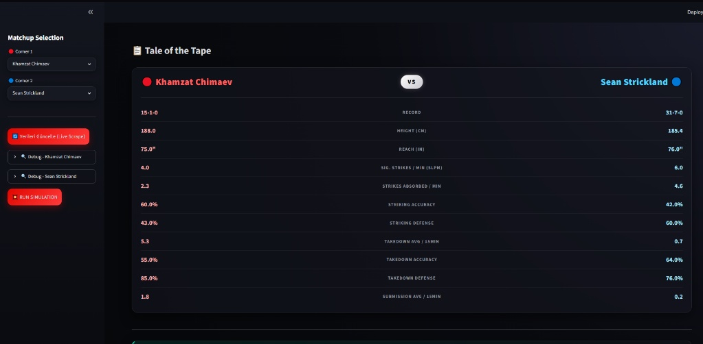
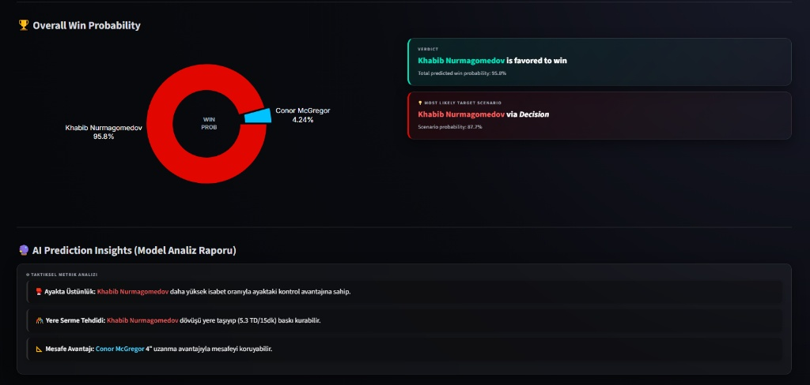

# 🥊 UFC Fight Night Predictor (XGBoost & Streamlit)

An AI-assisted, premium web application that predicts UFC fight outcomes using Machine Learning and live-scraped fighter data.

## 📊 Dataset & Model Statistics
This model isn't trained on tiny sandbox data; it processes a massive dataset containing real historical UFC records:
* **Total UFC Fighters Indexed:** `4,456` unique fighter profiles with complete morphological and tactical metrics.
* **Total Historical Fights Analyzed:** `8,552` official UFC bouts parsed and processed from local CSV databases.
* **XGBoost Data Split:** 15% Stratified Test Validation to ensure the highest predictive accuracy.

## 🚀 Features
* **Live Web Scraper:** Dynamically pulls up-to-date fighter records and stats directly from Sherdog.
* **Machine Learning Engine:** Powered by an optimized **XGBoost Classifier** evaluating striking metrics, grappling scores, control time, and physical advantages (reach/height diffs).
* **Premium UI/UX:** Built with a custom Cyberpunk-themed Streamlit interface.

## 🛠️ Tech Stack
* **Language:** Python
* **ML Frameworks:** Scikit-Learn, XGBoost
* **Data Processing:** Pandas, NumPy
* **Scraping:** BeautifulSoup4, Requests
* **Visualization:** Plotly Graph Objects
* **Frontend:** Streamlit & Custom CSS Integration

## 📊 How It Works
The model doesn't just look at wins and losses; it calculates complex mathematical metrics:
* **Grappling Score:** Derived from takedown accuracy, defense, submission averages, and historical control seconds.
* **Striking Score:** Evaluates significant strikes landed/absorbed per minute, knockdowns, and defense rates.
* **Simulation:** Weighs these stats against opponent data to output an overall victory probability and the most likely target scenario (e.g., KO/TKO, Submission, Decision).

## 📊 Project Showcase

### Tales of the Tape (Data Mining)

### Win Prediction & Insights

